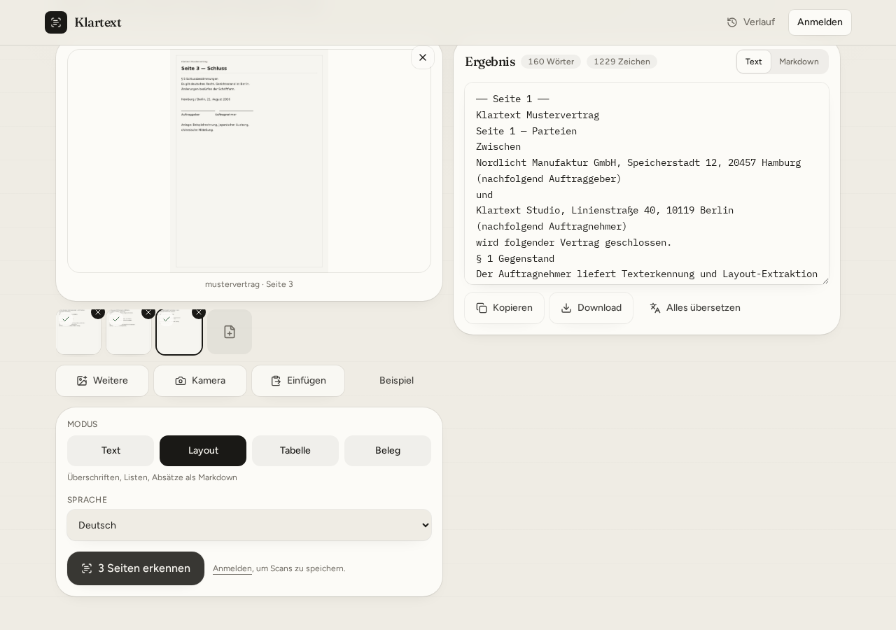
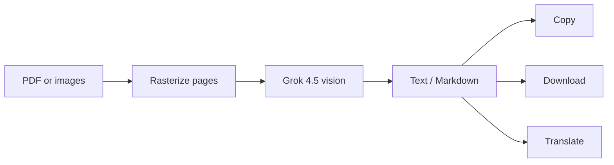

# Klartext

**AI OCR for photos, scans, receipts, and multi-page PDFs**

Reads the page. Keeps the original script. Lets you copy, download, or translate the whole document.

[Features](#features) · [How it works](#how-it-works) · [Usage](#usage) · [Modes](#ocr-modes) · [Languages](#languages) · [Stack](#stack)

 

 

---

## What it is

Klartext is a guest-first web app for turning documents into text.

Drop a photo, a stack of photos, or an entire PDF. Each page is read in order with Grok 4.5 vision. Japanese, Chinese, and mixed scripts stay as written — extraction does not translate. Translation is a separate step, on purpose.

No account required for OCR. Sign in only if you want a scan history.

---

## Features

| | |
| --- | --- |
| **Images** | JPG, PNG, WEBP — file picker, drag-and-drop, paste, or camera |
| **PDFs** | Full documents, rasterized in the browser, read page by page |
| **Series** | Several photos in one job, same queue as a PDF |
| **Layout** | Plain text, Markdown structure, tables, or receipts |
| **Scripts** | Latin, CJK, Arabic, Cyrillic — auto-detect or pin a language |
| **Export** | Copy, download `.txt` / `.md`, or translate the full result |
| **History** | Optional, for signed-in users |

Limit: **20 pages** per job. Pages are processed sequentially.

---

## How it works

1. Files never need an account to be read.
2. PDFs are turned into page images locally, then sent one by one.
3. The model returns structured JSON: title, language, plain text, Markdown.
4. **Alles übersetzen** translates every page into DE, EN, FR, ES, or IT.

---

## Usage

1. Drop a PDF or images — or open **Beispiel** for a sample invoice, Japanese notice, Chinese memo, 3-page contract, or a 3-photo series.
2. Choose a mode and a language, or leave **Automatisch**.
3. Click **Text erkennen** (or **N Seiten erkennen**).
4. Edit if needed, then **Kopieren**, **Download**, or **Alles übersetzen**.

The **Download** button sits under the result text, not in the header. It appears only after recognition finishes. Active tab decides the file: **Text** → `.txt`, **Markdown** → `.md`.

---

## OCR modes

| Mode | Best for |
| --- | --- |
| **Text** | Running copy, line breaks preserved |
| **Layout** | Headings, lists, and document structure as Markdown |
| **Table** | Columns as GitHub-flavored Markdown tables |
| **Receipt** | Merchant, line items, tax, totals |

---

## Languages

**Auto-detect** by default. Pin a language when you already know the script.

| | | |
| --- | --- | --- |
| German | English | French |
| Spanish | Italian | Portuguese |
| Dutch | Polish | Turkish |
| Russian | Chinese (简体 / 繁體) | Japanese |
| Arabic | | |

Extraction keeps original characters (漢字, かな, 汉字, …). Use **Translate** afterwards if you need another language.

---

## Stack

- **App** — TanStack Start, Vite, React 19, Tailwind CSS v4
- **OCR & translation** — Grok 4.5 (xAI vision + chat)
- **PDFs** — PDF.js, client-side
- **Accounts** — Better Auth, Postgres / PGLite (optional history)

---

## Status

Public preview. Guest OCR works without sign-in. History requires an account.
